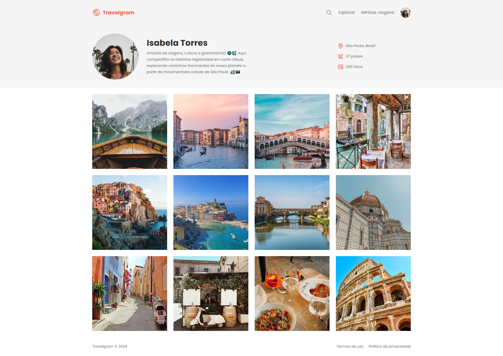

# 🌍 Travelgram

O **Travelgram** é um projeto desenvolvido para estudo prático de HTML e CSS. A ideia foi criar uma interface inspirada em redes sociais de viagem, com foco em design limpo, galeria de imagens e apresentação de perfil.

[🚀 Acesse o site ao vivo](https://nikolasmarlon.github.io/Travelgram/)

## 🧪 Tecnologias Utilizadas

- **HTML5**: Estrutura semântica da página.
- **CSS3**: Estilização visual com Flexbox.

## 💡 Conceitos Aplicados

- Utilização de **HTML semântico** para estruturação lógica.
- Organização visual com **Flexbox**.
- Galeria de imagens com espaçamento harmonioso.
- Ícones com **Font Awesome**.
- Separação de seções: cabeçalho, perfil, galeria e rodapé.

> ⚠️ Projeto ainda **não responsivo**. Ideal para visualização em desktops.

[🔗 Acesse o repositório no GitHub](https://github.com/nikolasmarlon/Travelgram)  
